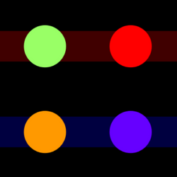

# Netychords
*An Accessible Digital Musical Instrument for playing chords through gaze and head movement.*

Please refer to the [Netychords page](https://neeqstock.notion.site/Netychords-3a666176e99545b2b022e56b863ba277) on Nicola Davanzo's personal website for more informations, instrument description and usage guide.

 

        

 

## Requirements
- A computer equipped with a Windows operating system
- Any sensor capable of moving the mouse cursor, which will be used for chord selection and to navigate the interface
    - (Suggested) an eye tracker, with some proper software
    - (Suggested) an eye tracker, with a NITH wrapper software
- (Optional but suggested) any of these NITH sensors, which will control strumming intensity and dynamics
    - [NITHheadTracker](https://neeqstock.notion.site/NITHheadTracker-BNO055-eda9cb4d752c45869abd85d06a1d7e5d) - which is the original interaction method for which Netychords was thought for
    - [NITHbreathSensor](https://neeqstock.notion.site/NITHbreathSensor-5010DP-b23a43406b4d432d974a42bbe0f63695)
    - [NITHbiteSensor](https://neeqstock.notion.site/NITHbiteSensor-FSR-d0dabadc9abe470eb583985b22f3d2a9)

If you don't possess any of these sensors you will still be able to try Netychords using your mouse, and play using the spacebar.

## Installation and running

1. Download the latest release from the 
 page
2. Unzip the archive
3. Run Netychords.exe

## Contribution

Netychords is licensed through a GNU GPL-v3 Free Open-Source software license. Feel free to fork this repository and contribute!

## Issues

If you have any issue and/or proposal related to Netychords, please open a GitHub issue on this repository, or write an e-mail to: *nicola(dot)davanzo(at)unimi(dot)it*

## Acknowledgements

Many thanks to *Matteo De Filippis*, one of our thesis students, for the development of the first version of Netychords. <3

Enjoy!

